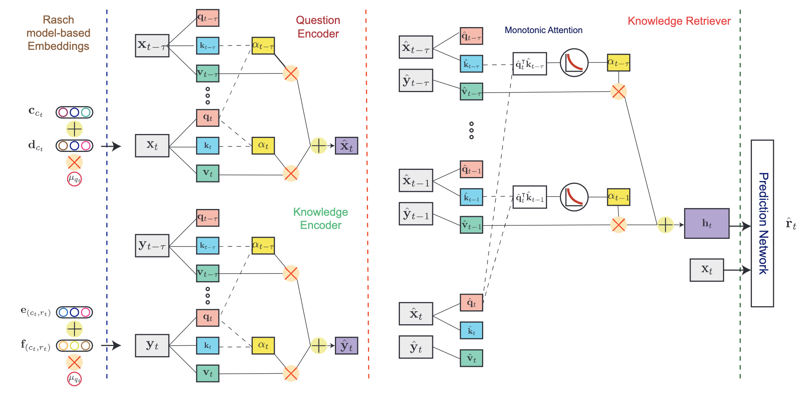
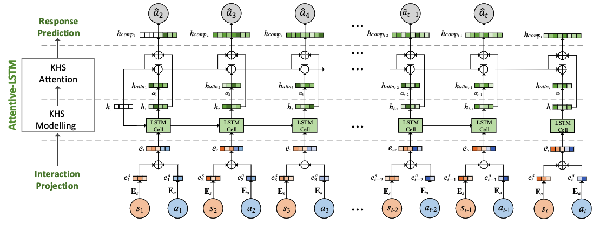
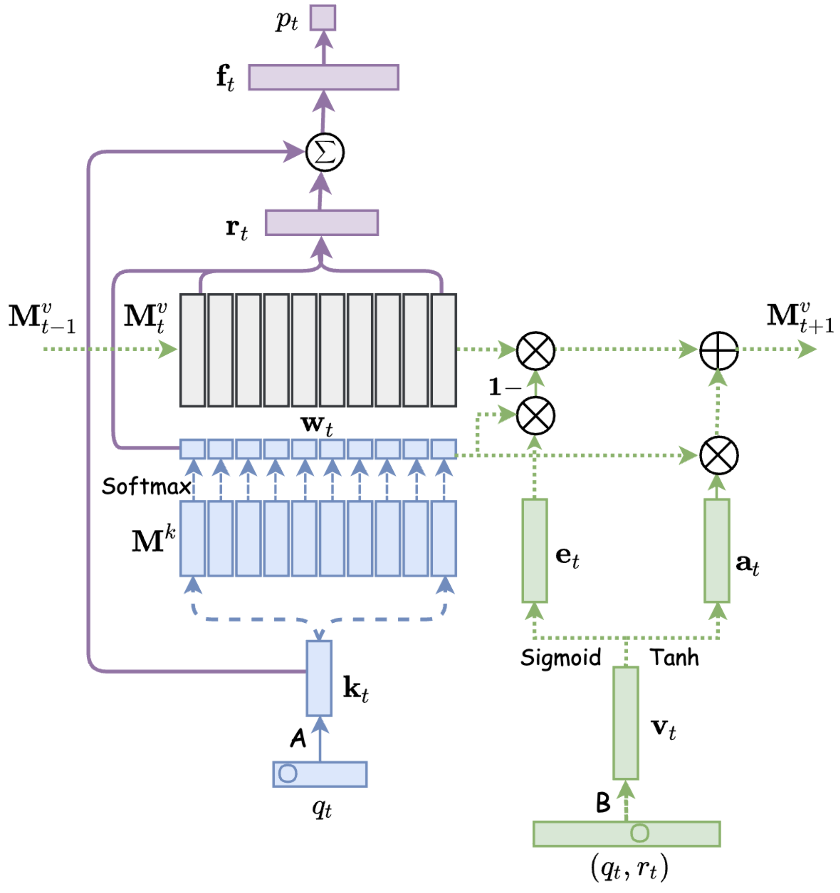
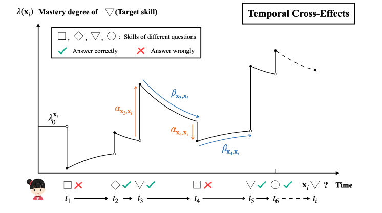
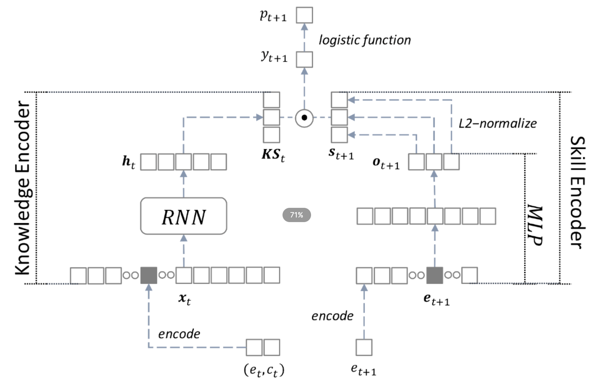
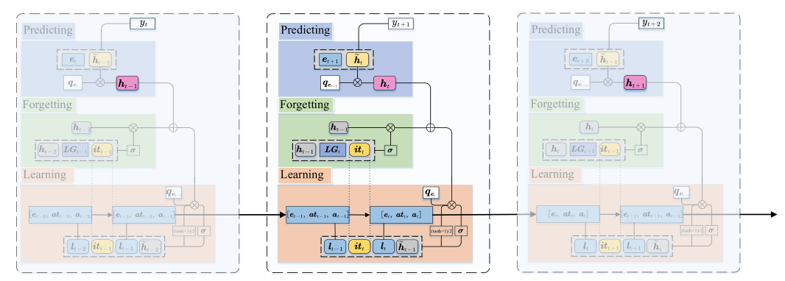
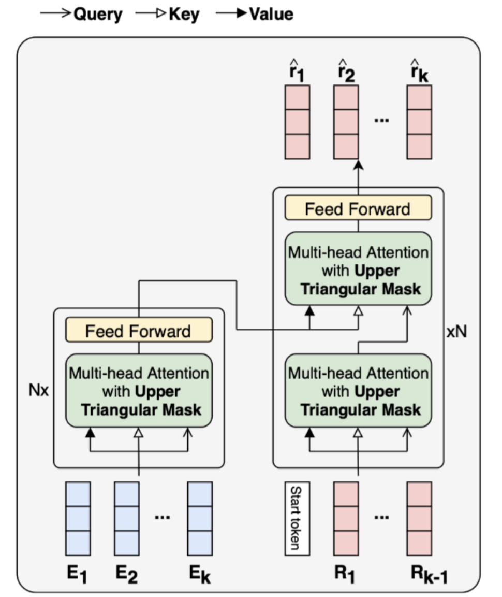
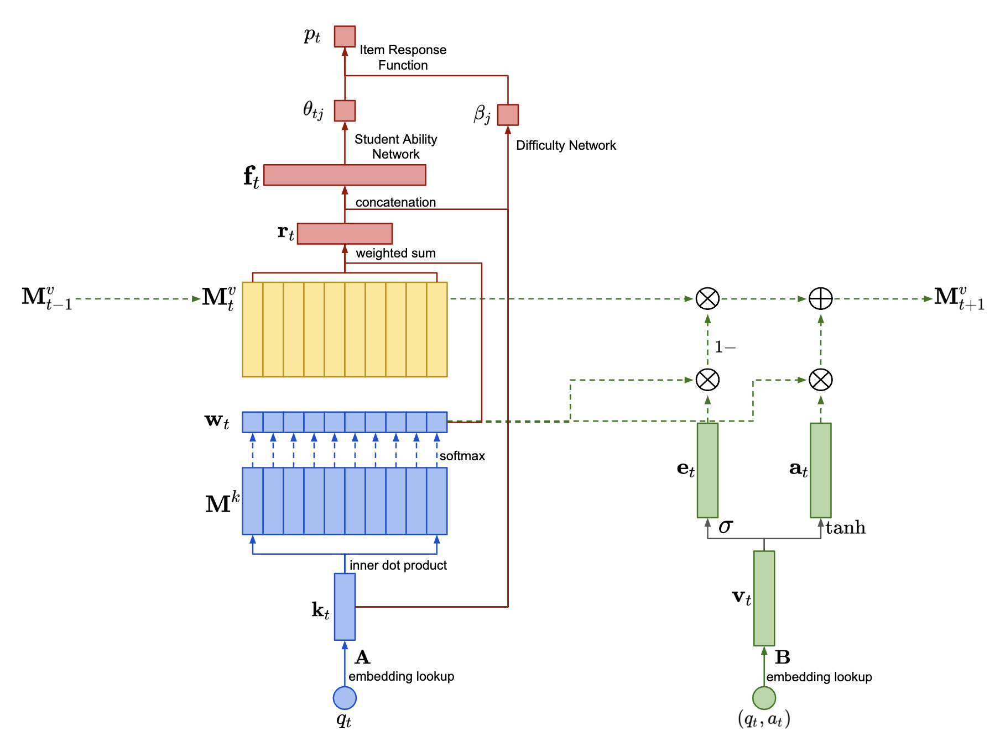

# Models
Since the deep learning based KT models can be categorized into deep sequential models, memory augmented models, adversarial based models, graph based models and attention based models in our work, we mantle the KT models in these four categories in PyKT.

|   Models   |    Category    |
|:----------:|:--------------:|
| AKT        |    Attention   |
| ATKT       |   Adversarial  |
| DKT-Forget |    Sequential  |
| DKT        |    Sequential  |
| DKT+       |    Sequential  |
| DKVMN      |     Memory     |
| GKT        |      Graph     |
| HawkesKT   | Neural Network |
| IEKT       |    Sequential  |
| KQN        |    Sequential  |
| LPKT       |    Sequential  |
| SAINT      |    Attention   |
| SAKT       |    Attention   |
| SKVMN      |     Memory     |

##  AKT
<!-- Attentive knowledge tracing (AKT) is a model which couples flexible attention-based neural network models with a series of novel, interpretable model components inspired by cognitive and psychometric models. -->
Attentive knowledge tracing (AKT) introduce a rasch model to regularize the KC and question embeddings to discriminate the questions on the same KC, and modeling the exercise representations and the students' historical interactdion embeddings via three self-attention based modules.

[Ghosh, Aritra, Neil Heffernan, and Andrew S. Lan. "Context-aware attentive knowledge tracing." Proceedings of the 26th ACM SIGKDD international conference on knowledge discovery & data mining. 2020.](https://dl.acm.org/doi/pdf/10.1145/3394486.3403282)

##  ATKT
Adversarial training (AT) based KT method (ATKT) is an attention based LSTM model which apply the adversarial perturbations into the original student interaction sequence to reduce the the risk of DLKT overfitting and limited generalization problem.

[Guo, Xiaopeng, et al. "Enhancing Knowledge Tracing via Adversarial Training." Proceedings of the 29th ACM International Conference on Multimedia. 2021.](https://arxiv.org/pdf/2108.04430)

##  DKT-Forget
 DKT-Forget explores the deep knowledge tracing model by considering the forgetting behavior via incorporate multiple forgetting information.

[Nagatani, Koki, et al. "Augmenting knowledge tracing by considering forgetting behavior." The world wide web conference. 2019.](https://dl.acm.org/doi/10.1145/3308558.3313565)

##  DKT
DKT is the first model that uses Recurrent Neural Networks (RNNs) to solve Knowledge Tracing.

[Piech, Chris, et al. "Deep knowledge tracing." Advances in neural information processing systems 28 (2015).](https://proceedings.neurips.cc/paper/2015/file/bac9162b47c56fc8a4d2a519803d51b3-Paper.pdf)

##  DKT+
DKT+ introduces regularization terms that correspond to reconstruction and waviness to the loss function of the original DKT model to enhance the consistency in KT prediction.

<!--  -->

[Yeung, Chun-Kit, and Dit-Yan Yeung. "Addressing two problems in deep knowledge tracing via prediction-consistent regularization." Proceedings of the Fifth Annual ACM Conference on Learning at Scale. 2018.](https://arxiv.org/pdf/1806.02180)

##  DKVMN 
Dynamic key-value memory networks (DKVMN) exploit the relationships between latent KCs which are stored in a static memory matrix *key* and predict the knowledge mastery level of a student directly based on a dynamic memory matrix *value*.

[Zhang, Jiani, et al. "Dynamic key-value memory networks for knowledge tracing." Proceedings of the 26th international conference on World Wide Web. 2017.](https://arxiv.org/abs/1611.08108)

##  GKT
Graph-based Knowledge Tracing (GKT) is a GNN-based knowledge tracing method that use a graph to model the relations between knowledge concepts to reformulate the KT task as a time-series node-level classification problem.

[Nakagawa, Hiromi, Yusuke Iwasawa, and Yutaka Matsuo. "Graph-based knowledge tracing: modeling student proficiency using graph neural network." 2019 IEEE/WIC/ACM International Conference On Web Intelligence (WI). IEEE, 2019.](https://ieeexplore.ieee.org/abstract/document/8909656/)

##  HawkesKT
HawkesKT is the first to introduce Hawkes process to model temporal cross effects in KT.

[Wang, Chenyang, et al. "Temporal cross-effects in knowledge tracing." Proceedings of the 14th ACM International Conference on Web Search and Data Mining. 2021.](http://www.thuir.cn/group/~mzhang/publications/WSDM2021-WangChenyang.pdf)

##  IEKT
Individual Estimation Knowledge Tracing (IEKT) estimates the students' cognition of the question before response prediction and assesses their knowledge acquisition sensitivity on the questions before updating the knowledge state.

[Long, Ting, et al. "Tracing knowledge state with individual cognition and acquisition estimation." Proceedings of the 44th International ACM SIGIR Conference on Research and Development in Information Retrieval. 2021.](https://wnzhang.net/papers/2021-sigir-iekt.pdf)

##  KQN

KQN uses neural networks to encode student learning activities into knowledge state and skill vectors, and calculate the relations between the interactions via dot product. 

[Lee, Jinseok, and Dit-Yan Yeung. "Knowledge query network for knowledge tracing: How knowledge interacts with skills." Proceedings of the 9th international conference on learning analytics & Knowledge. 2019.](https://arxiv.org/pdf/1908.02146)

##  LPKT

Learning Processconsistent Knowledge Tracing(LPKT) monitors students' knowledge state by directly modeling their learning process.

[Shen, Shuanghong, et al. "Learning process-consistent knowledge tracing." Proceedings of the 27th ACM SIGKDD Conference on Knowledge Discovery & Data Mining. 2021.](http://staff.ustc.edu.cn/~huangzhy/files/papers/ShuanghongShen-KDD2021.pdf)

##  SAINT

Separated Self-AttentIve Neural Knowledge Tracing(SAINT) is a typical Transformer based structure which embeds the exercises in encoder and predict the responses in decoder.

[Choi, Youngduck, et al. "Towards an appropriate query, key, and value computation for knowledge tracing." Proceedings of the Seventh ACM Conference on Learning@ Scale. 2020.](https://arxiv.org/pdf/2002.07033.pdf)

##  SAKT

Self Attentive Knowledge Tracing (SAKT) use self-attention network to capture the relevance between the KCs and the students' historical interactions.

[Pandey, Shalini, and George Karypis. "A self-attentive model for knowledge tracing." arXiv preprint arXiv:1907.06837 (2019).](https://arxiv.org/pdf/1907.06837.pdf)

##  SKVMN

This model unifies the strengths of recurrent modeling capacity and the capability of memory networks to model the students' learning precocesses.

[Abdelrahman, Ghodai, and Qing Wang. "Knowledge tracing with sequential key-value memory networks." Proceedings of the 42nd International ACM SIGIR Conference on Research and Development in Information Retrieval. 2019.](https://arxiv.org/pdf/1910.13197.pdf)

## qDKT
qDKT(base) is a model same as DKT, but use the question ID as the input.

[Sonkar, Shashank, et al. "qdkt: Question-centric deep knowledge tracing." arXiv preprint arXiv:2005.12442 (2020).](https://arxiv.org/pdf/2005.12442.pdf)

## Deep-IRT

Deep-IRT is a synthesis of the item response theory (IRT) model and a knowledge tracing model that is based on the deep neural network architecture called dynamic key-value memory network (DKVMN) to make deep learning based knowledge tracing explainable.

[Yeung, Chun-Kit. "Deep-IRT: Make deep learning based knowledge tracing explainable using item response theory." arXiv preprint arXiv:1904.11738 (2019).](https://arxiv.org/pdf/1904.11738.pdf)
