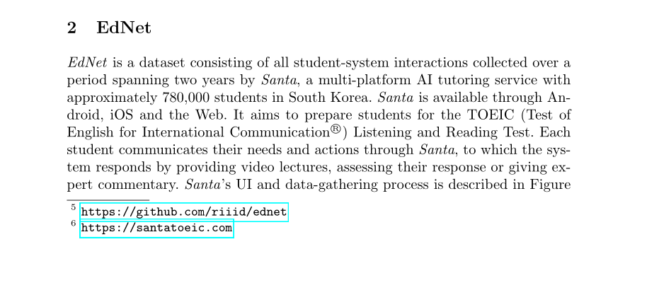
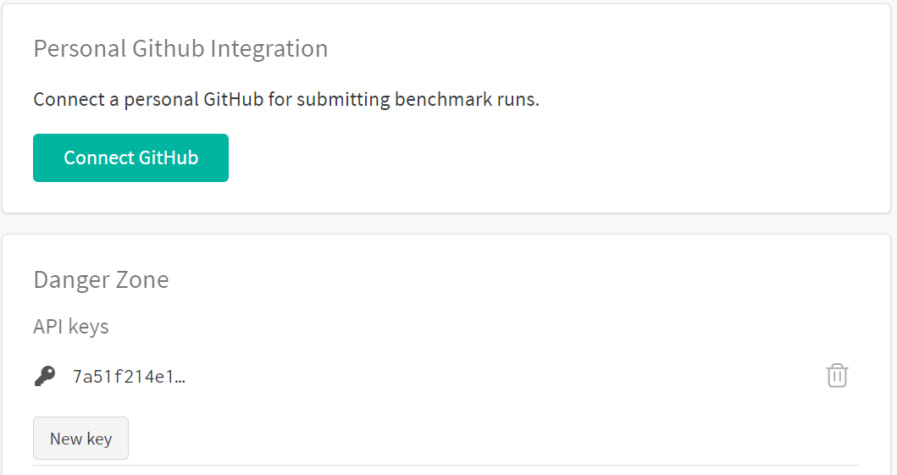
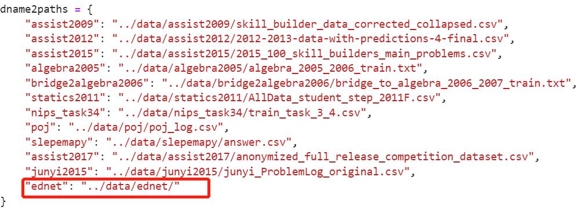
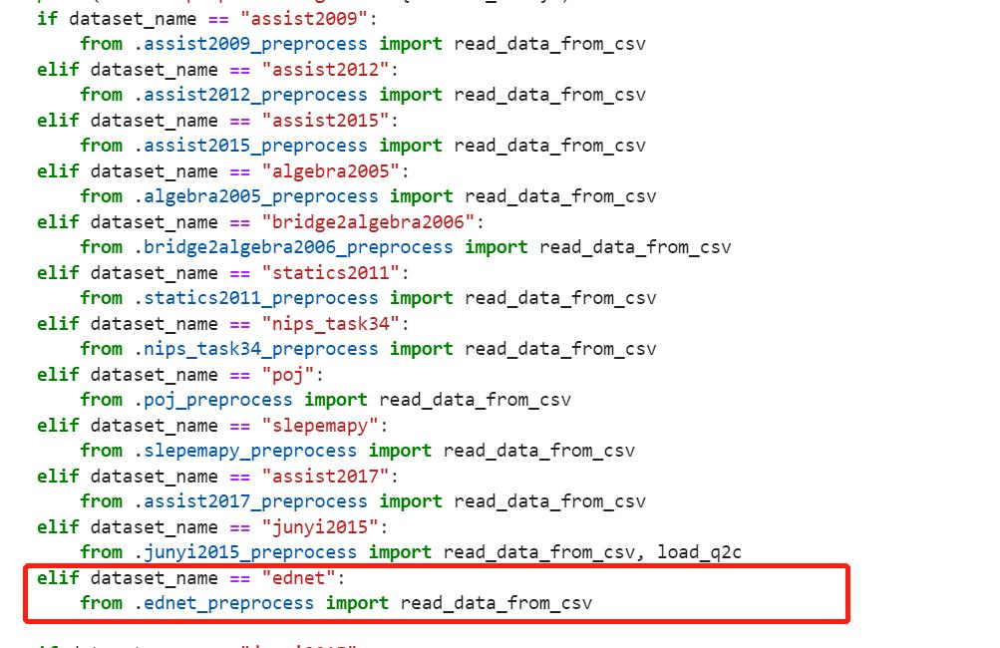

# Welcome to PyKT

## Installation
You can specify to install it through `pip`.

```shell
pip install -U pykt-toolkit
```

We recommend creating a new Conda environment using the following command.

```shell
conda create --name=pykt python=3.7.5
source activate pykt
pip install -U pykt-toolkit
```

## Train Your First Model

### Download a Dataset

You can find the download link for a dataset from the paper that presented it.



Download the dataset to the `pykt-toolkit-main/data` folder.

### Preprocess a Dataset

`python data_preprocess.py [parameter]`

```
Args:
    --dataset_name: dataset name, default=“assist2015”
    --min_seq_len: minimum sequence length, default=3
    --maxlen: maximum sequence length, default=200
    --kfold: divided folds, default=5

Example:
cd examples
python data_preprocess.py --dataset_name=ednet
```


#### Data Preprocess Standards

##### Field Extraction

For any data set, we mainly extract 6 fields: user ID, question ID (name), skill ID (name), answering status, answer submission time, and answering time (if the field does not exist in the dataset, it is represented by NA) .

##### Data Filtering

For each answer record, if any of the five fields of user ID, question ID (name), skill ID (name), answer status, and answer submission time are empty, the answer record will be deleted.

##### Data Sorting

Each student's answer sequence is sorted according to the answer order of the students. If different answer records of the same student appear in the same order, the original order is maintained, that is, the order of the answer records in the original data set is kept consistent.

##### Character Process

- **Field concatenation:** Use `--` as the connecting symbol. For example, Algebra2005 needs to concatenate `Problem Name` and `Step Name` as the final problem name.
- **Character replacement:** If there is an underline `_` in the question and skill of original data, replace it with `####`. If there is a comma `,` in the question and skill of original data, replace it with `@@@@`.
- **Multi-skill separator:** If there are multiple skills in a question, we separate the skills with an underline `_`.
- **Time format:** The answer submission time is a millisecond (ms) timestamp, and the answer time is in milliseconds (ms).

##### Output data format

After completing the above data preprocessing, each dataset will generate a data.txt file in the folder named after it (data directory). Each student sequence contains 6 rows of data as follows:

```
User ID, sequence length
Question ID (name)
skill ID (name)
Answer status
Answer submission time
time to answer

example:
50121, 4 
106101, 106102, 106103, 106104 
7014, 7012, 7014, 7013 
0, 1, 1, 1 
1647409594000, 1647409601000, 1647409666000, 1647409694000 
123, 234, 456, 789 
```

### Training a Model

`python wandb_modelname_train.py [parameter]`

```shell
CUDA_VISIBLE_DEVICES=2 nohup python wandb_sakt_train.py --dataset_name=assist2015 --use_wandb=0 --add_uuid=0 --num_attn_heads=2 > sakt_train.txt &
```

Run the `get_wandb_new` file. If the model has selected more than 300 sets of parameters, and the most recent 100 sets of parameters have not achieved optimal results on the test set (that is, when end! is output), stop.

### Evaluating a Model
Run the `get_wandb_new` file to generate the `{modal name}_{emb type}_pred.yaml` file, modify the program keyword in the YAML file, and change its path to `./wandb_predict.py` or `wandb_predict.py` .

Then, execute the following command:

```shell
WANDB_API_KEY=xxx wandb sweep all_wandbs/dkt_qid_pred.yaml -p pykt_wandb
(xxx is your api_key, pykt_wandb is your project name)

CUDA_VISIBLE_DEVICES=0 WANDB_API_KEY=xxx nohup wandb agent swwwish/pykt_wandb/qn91y02m &
(qn91y02m is the agent name generated after the first command line is executed)
```


In this stage, only 5 sweeps will be run, and no parameter tuning will be involved. After the end, export the results externally or call the wandb API for statistical results, and calculate the mean and standard deviation of each indicator in the five sweeps. The final comprehensive result is: ***mean ± standard deviation***

## Hyperparameter Tuning

### Create a Wandb Account
Weights & Biases (Wandb) is the machine learning platform for developers to build better models faster. 

Visit the [Wandb](https://wandb.ai/) webpage, register an account and get the API key. Remember your user id and API key.



Then you can configure your own `uid` and `api_key` in `configs/wandb.json`

### Write a Sweep Config

`python generate_wandb.py [parameter]`


```
Parameter:
       --src_dir: The parameter configuration file path of the model
       --project_name: Project name on wandb, default: kt_toolkits
       --dataset_names: Dataset names, you can fill in multiple, separated by commas ",", default: "assist2015"
       --model_names: Model names, you can fill in multiple, separated by commas ",", default: dkt
       --folds: Default: "0,1,2,3,4"
       --save_dir_suffix: Add extra characters to the model storage path name, default: ""
       --all_dir: Generate the configuration file of the model for this dataset, default: "all_wandbs"
       --launch_file: Generated sweep startup script, default: "all_start.sh"
       --generate_all: The input is "True" or "False", indicating whether to generate the wandb startup files of all datasets and models in the all_dir directory (True means: generate the startup files of all data models in the all_dir directory, False means: only the current execution is generated data model startup file), default: "False"
```

### Start the Sweep

**Step1**: `sh [launch_file] [parameter]`

```shell
sh [launch_file] > [Directed log] 2>&1
   
    - [launch_file]: required, the user submits the script of sweep to wandbs, and directs the execution output to [directed log])
    - [Directed log]: Required, execute the sweep in the log
```
Example:
```shell
python generate_wandb.py --dataset_names="assist2009,assist2015" --model_names="dkt,dkt+"
sh all_start.sh > log.all 2>&1
(The log file needs to be defined by yourself. )
```

**Step 2:** `sh run_all.sh [parameter]`

```shell
sh run_all.sh [Directed log] [start_sweep] [end_sweep] [dataset_name] [model_name] [gpu_ids] [project_name]

    - [Directed log]: Required, execute the sweep in the log
    - [start_sweep]: Required, the start id to start a sweep
    - [end_sweep]: Required, start sweep end id
    - [dataset_name]: Required, dataset name
    - [model_name]: Required, model name
    - [gpu_ids]: Required, GPU ID
    - [project_name]: optional, default: kt_toolkits
    Execute run_all.sh, start sweep, read [directed log] here
```

Example:

```shell
sh run_all.sh log.all 0 5 assist2015 dkt 0,1,2,3,4
```

### Start Agents

```shell
sh start_sweep_0_5.sh
(0_5 represents the start sweep and end sweep)
```

## Add Your Datasets

If you want to add a new dataset, please create a new dataset folder in the `data` directory with the name of the dataset. Then, you can store the data source files in this directory and refer to our data prediction processing standard in the `preprocess` directory to write the processing script` [dataset name]_preprocess.py`.

For preprocessing standards, you can refer to the section "preprocess a dataset".

Then add the data path in `data_preprocess.py`.



Moreover, import the preprocess file in `preprocess/data_proprocess.py`.



<!-- ## Add Your Models(todo) -->